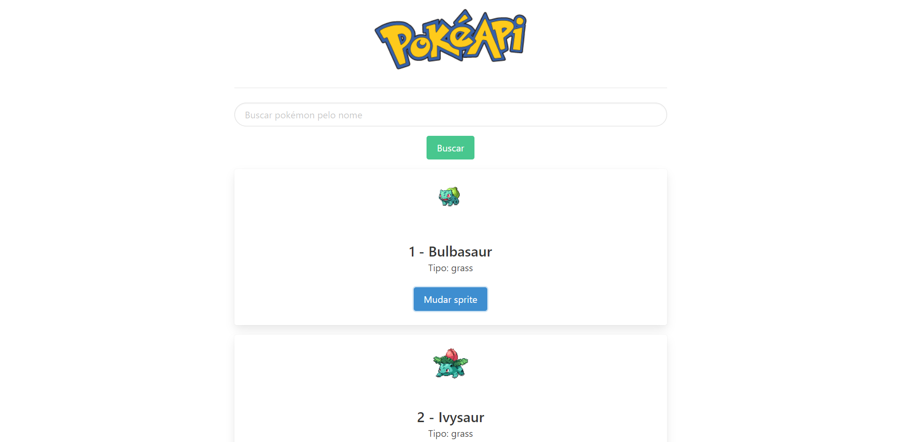

# Pokedex Vue.js app
App desenvolvido durante o curso Formação Node.js, para aplicar os conhecimentos obtidos sobre o framework Vue.js. O app consome dados obtidos da API pública [PokeAPI](https://pokeapi.co/).

## Captura de tela
Demonstração: [Live Preview](https://vue-app-pokedex.herokuapp.com/)

<p align="center">
  
</p>

## Setup do projeto

### Instalação das dependências
```
yarn install
```

### Compilação de uma versão de desenvolvimento
```
yarn serve
```

### Compilação de uma versão para produção
```
yarn build
```